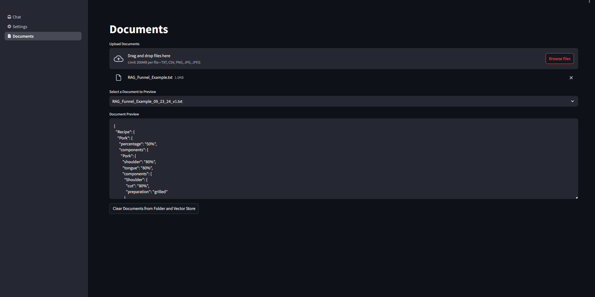
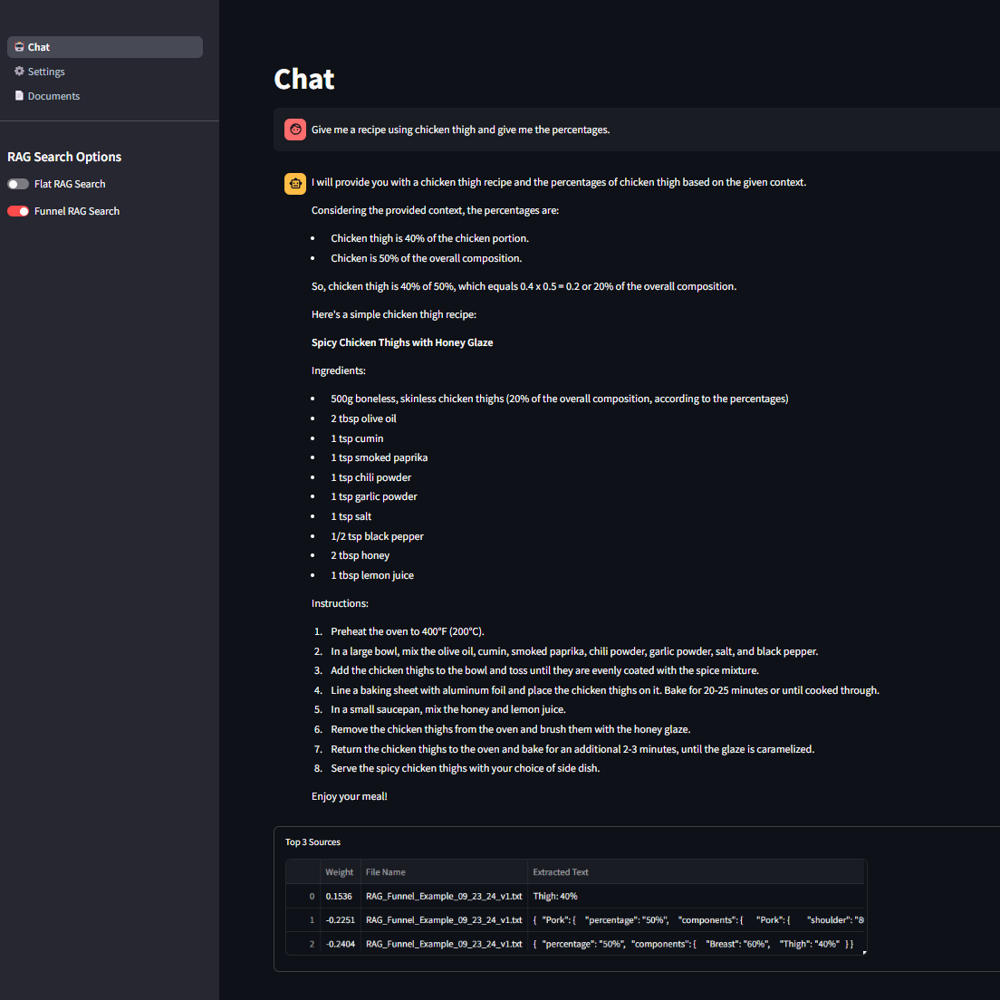

# Streamlit RAG Chatbot
Streamlit RAG Chatbot is a powerful and interactive web application built with **Streamlit** that allows users to chat with an AI assistant. The application integrates **ChromaDB** for document embedding and search functionalities and uses **Groq** to handle queries efficiently. The system supports both Flat and Funnel Retrieval-Augmented Generation (RAG) search methods, offering a flexible search experience.

<table>
  <tr>
    <td>
      
    </td>
    <td>
      
    </td>
  </tr>
</table>

## Features

- **Interactive Chat Interface**: Engage with the chatbot directly in the browser, powered by a highly advanced large language model (LLM).
- **Flat RAG Search**: Leverage cosine similarity-based search for document retrieval.
- **Funnel RAG Search**: Perform hierarchical document retrieval using L2 distance for in-depth context discovery.
- **Document Upload and Processing**: Upload documents to vectorize and embed into the database for efficient search.
- **Customizable System Prompt**: Define the behavior and personality of the chatbot with a customizable prompt.
- **File Versioning**: Automatically handles versioning of uploaded documents.

## Installation

To set up the LLM Chatbot application, follow these steps:

1. **Clone the repository**:
    ```sh
    git clone https://github.com/leporejoseph/streamlit_Rag.git
    cd streamlit_Rag
    ```

2. **Install dependencies**:
    ```sh
    pip install -r requirements.txt
    ```

3. **Run the application**:
    ```sh
    streamlit run main.py
    ```

## Usage

1. **Chat with the Bot**: Navigate to the **Chat** page to start a conversation with the assistant. You can customize the assistant’s behavior by modifying the system prompt in the **Settings**.
2. **Upload Documents**: Go to the **Documents** page to upload files for vectorization and embedding into ChromaDB. Supported formats: `.txt`, `.csv`, `.json`, `.png`, `.jpg`.
3. **Search Options**: Use **Flat RAG Search** or **Funnel RAG Search** to perform retrieval-augmented generation based on different distance functions.

## Directory Structure

```sh
llm-chatbot/
│
├── content/                     # Images and other media files
│   ├── chatbot_ui_1.png
│   └── chatbot_ui_2.png
├── documents/                   # Uploaded documents for vectorization
├── chroma_db/                   # ChromaDB files
├── main.py                      # Main application script
├── requirements.txt             # Python dependencies
└── README.md                    # This file
